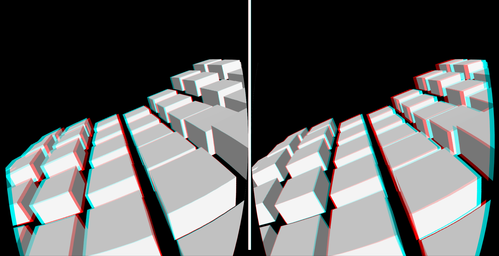

# ThreeVR

  Current Three.js and VR experiments using [three-quickvr](https://github.com/halvves/three-quickvr) Boilerplate. Really good with iOS/Cardboard for some fun quick VR testing. Building some small apps and wanted a playground to get my feet wet.

  ```index.js``` points to => ```Cartridge/index.js``` where all the Magic should happen..

## Run the example
  Requires Node v7.0.0 or greater


```bash
$ yarn install
$ yarn dev & open http://localhost:2020
```

## License

[MIT]
