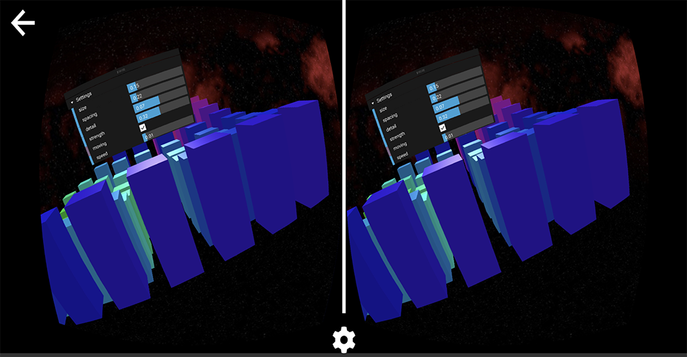

# ThreeVR WebVR Experiments and UI tests

  My goal is to learn WebVR and experiment with interfaces and experiences with 3Dof VR experiments. The base application is using [three-quickvr](https://github.com/halvves/three-quickvr) boilerplate built upon [Three.js](https://threejs.org/). It's a really good starting point for doing Vr experiences. While this setup will work with Cardboard and all 3Dof/6Dof VR devices, interactions will require a VR controller. My default development devices is an Oculus Go 3Dof VR headset and should work with most devices.

  #### Current Experiment
  The main render is a simplex noise function over a grid of objects, and using dat.guiVR you can control and change settings in real-time.

  ##### Past Experiment
  - MazeVR - binary maze and some testing for using the thumpad to move around the world environment. 
  - Monobus - particle system that allows the user to interact with the settings such as gravity and bounce. 
  - Tunnel - fly though a dark tunnel, no user interaction. 

 ## Application and Demo

  The apps entry point is the index file which points to one of the other JS files containing ```Render``` classes. Example and default is ```index.js``` points to => ```Cartridge/index.js``` where all the Magic should happen..

  Other experiments are saved in ```src/archive``` and you can easily point the index file. 

  ##### index.js - change the import at the top.
  ```javascript
// import Render from './Cartridge/'; <-- comment this out
import Render from './archive/MazeVR/';

/* other stuff */

window.onload = () => {
  const demo = new Render();
  return demo;
};
```

 ## Libraries
  Controller help and utilities [THREE.VRController](https://github.com/stewdio/THREE.VRController) which makes a lot of the work easy for showing visual feedback to a VR controller. Easy to wire up with callbacks, this was such a big help!
  
  Visual interface using [dat.guiVR](https://github.com/dataarts/dat.guiVR), the VR version of the original 2D customizable configuration panel.

## Run the example
  Requires Node v7.0.0 or greater


```bash
$ yarn install
$ yarn dev & open http://localhost:2020
```

## License
